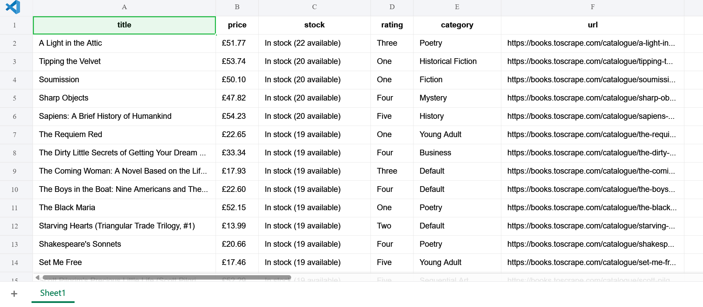

# Books Scraper

A Selenium-based web scraping project using Page Object Model (POM).

## Features

- Pagination scraping
- Detail page scraping
- CSV / Excel export
- Retry handling
- Logging
- Pytest tests
- Headless mode
- Page Object Model architecture
- Docker support

## Tech Stack

- Python
- Selenium
- pytest
- pandas


## Run

```bash
docker build -t books-scraper .
docker run --rm -v ${PWD}/data:/app/data books-scraper
```


## Sample Output




## Test

```bash
uv run pytest -v
==================== test session starts ====================
platform win32 -- Python 3.11.15, pytest-9.0.3, pluggy-1.6.0 -- C:\Users\user\books-scraper\.venv\Scripts\python.exe
cachedir: .pytest_cache
rootdir: C:\Users\user\books-scraper
configfile: pytest.ini
collected 3 items

tests/test_scraper.py::test_scrape_books_return_list PASSED [ 33%]
tests/test_scraper.py::test_scrape_books_not_empty PASSED [ 66%]
tests/test_scraper.py::test_book_has_required_keys PASSED [100%]

=============== 3 passed in 65.12s (0:01:05) ================
```

## Logging

```text
2026-05-22 19:31:50,575 - INFO - Collected URLs: 20
2026-05-22 19:31:51,906 - INFO - Collected URLs: 40
2026-05-22 19:31:53,001 - INFO - Collected URLs: 60
```

## License

MIT License